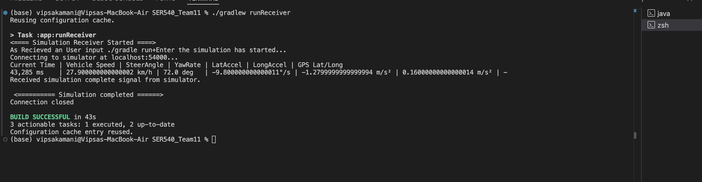
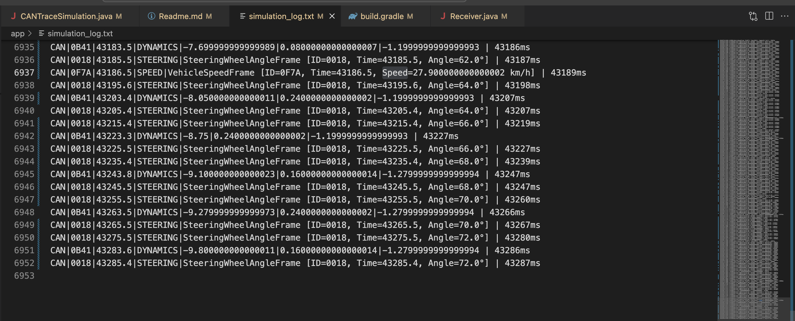
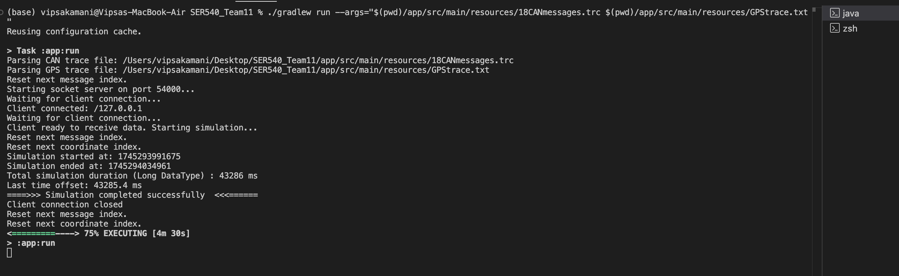

# Project README

# CAN Trace Simulation Project

## Overview

This project simulates/replays sensor values from a test drive with accurate timing. The simulation uses CAN trace data and GPS coordinates to recreate the exact timing and values recorded during a test drive. The system consists of a Simulator (server) and a Receiver (client) that communicate through a socket connection.

## Project Structure

### Core Components

1. **Simulator**: Acts as a socket server that sends sensor values with accurate timing.
2. **Receiver**: Acts as a client that connects to the Simulator, receives values, and displays them in real-time.
3. **CAN Trace Parser**: Parses the CAN trace file and creates a data structure with the sensor values.
4. **GPS Parser**: Parses the GPS coordinates file and creates a data structure with the GPS coordinates.

### Classes and Their Functions

| Class                     | Description                                                              |
| ------------------------- | ------------------------------------------------------------------------ |
| `CANTraceSimulation`      | Main class that handles the server-side simulation and timing.           |
| `Receiver`                | Client application that connects to the simulator and displays the data. |
| `CANFrame`                | Abstract base class for all CAN frame types.                             |
| `SteeringWheelAngleFrame` | Frame containing steering wheel angle data.                              |
| `VehicleSpeedFrame`       | Frame containing vehicle speed data.                                     |
| `VehicleDynamicsFrame`    | Frame containing vehicle dynamics data (yaw rate, accelerations).        |
| `CANTrace`                | Data structure to store and manage CAN frames.                           |
| `CANTraceParser`          | Parser to read and decode CAN trace files.                               |
| `GPScoordinates`          | Class to store GPS coordinate data.                                      |
| `GPSTrace`                | Data structure to store and manage GPS coordinates.                      |
| `GPSParser`               | Parser to read GPS coordinate files.                                     |

## Getting Started

### Prerequisites

- Java 21 or higher
- Gradle 8.x

### Setup and Installation

1. Clone the repository
2. Navigate to the project directory (in this case it's SER540_Team11)

### Compiling and Running

To compile the project, run:

```bash
./gradlew build
```

### Note : Open two terminal on the IDE in one Paste "1. Running the Simulator" and in another terminal paste for client side "2. Running the Receiver"

#### 1. Running the Simulator

To run the Simulator, you need to provide both CAN trace and GPS trace file paths:

```bash
./gradlew run --args="$(pwd)/app/src/main/resources/18CANmessages.trc $(pwd)/app/src/main/resources/GPStrace.txt"
```

#### 2. Running the Receiver

To run the Receiver client:

```bash
./gradlew runReceiver
```

## Troubleshooting

0. **Cache first time Issue**

   - If the ./gradlew runReceiver doesn't work for first time (it's because cache is not established ) therefor try running it the second time again.

1. **Socket Connection Refused**:

   - Ensure the Simulator is running before starting the Receiver
   - Check that port 54000 is not blocked by your firewall

2. **Missing or Invalid Data**:
   - Verify that your CAN trace and GPS trace files are correctly formatted
   - Check that file paths are specified correctly when running the Simulator

```bash
./gradlew run --args="<canfile_path> <GPSfile_path>"
```

3. **Custom gradle file missing **:
   - Issue with running ./gradlew runReceiver command then check if the gradle has this if not add it:

```bash
task runReceiver(type: JavaExec) {
    description = 'Run the Receiver application'
    group = 'application'
    mainClass = 'org.automotive.Receiver'
    classpath = sourceSets.main.runtimeClasspath
}
```

4. **Others**:
   - Try to clean build you Gradle

```bash
./gradlew clean build
```

## Project Features

#### Simulation Features

- Real-time playback of sensor values with precise timing
- Concurrent handling of CAN frames and GPS coordinates
- Socket-based client-server architecture for data transmission
- Support for multiple sensor types (steering wheel angle, vehicle speed, yaw rate, accelerations)

#### Display Features

- Real-time console display of all sensor values (Client Side)
  
- Log file creation with timestamps and system time deltas
  
- Console Output showing Server side socket connection msges
  

## LOG FILE DESIGN

#### CAN Frame Format

```
CAN|ID|TIMESTAMP|FRAME_TYPE-VALUES|CURRENT_TIME
```

Example:

```
CAN|0018|443.8|STEERING|SteeringWheelAngleFrame [ID=0018, Time=443.8, Angle=2.0°] | 447ms
CAN|0B41|6.8|DYNAMICS|-0.8799999999999955|0.7200000000000006|-0.2400000000000002 | 31ms
CAN|0F7A|467.1|SPEED|VehicleSpeedFrame [ID=0F7A, Time=467.1, Speed=73.3 km/h] | 470ms
```

#### GPS Data Format

```
GPS|TIMESTAMP|LATITUDE|LONGITUDE|CURRENT_TIME
```

Example:

```
[ GPS ]|0.0|52.721103|13.223500 | 16ms
```

## Implementation Details

### Timing Mechanism

The simulation maintains accurate timing by:

1. Tracking the real system time since simulation start
2. Calculating the appropriate wait time before sending each message
3. Ensuring sensor values are delivered at exactly the same offsets as in the original recordings

### Multithreading

- The Simulator uses separate threads for each client connection
- The Receiver uses separate threads for socket reception and message processing

## Output Images


#### as we can see that the when GPStrace.txt file has no data then the startsimulation is printing a error msg


### Youtube Video Link

https://youtu.be/7fRhUcglkjM
