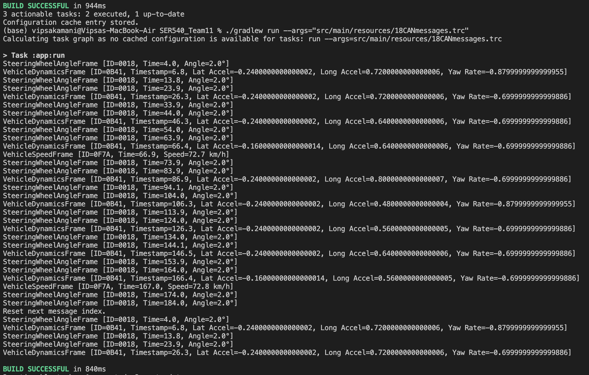
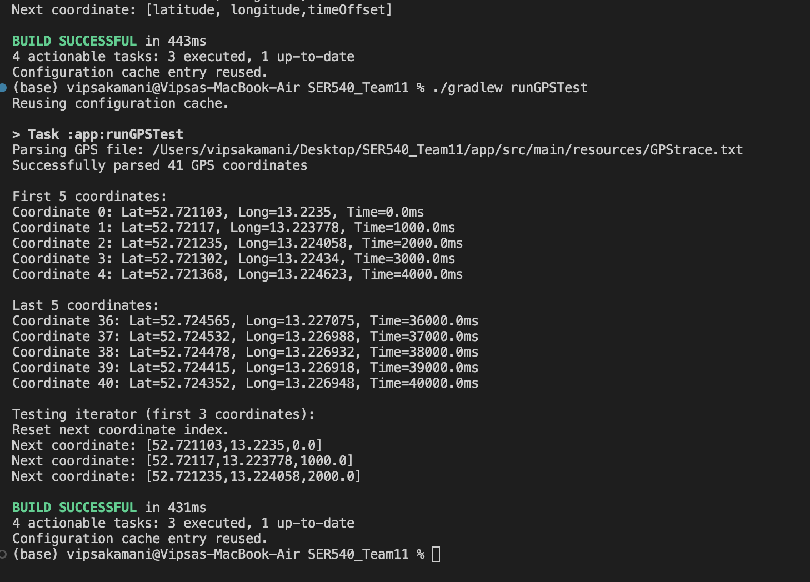
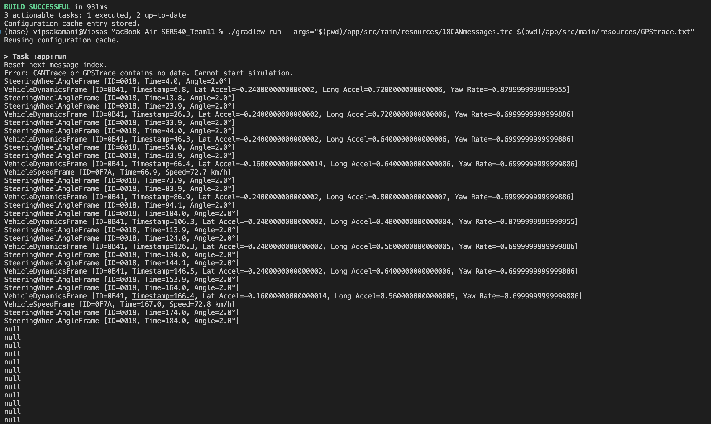

# Project README

## Output




### as we can see that the when GPStrace.txt file has no data then the startsimulation is printing a error msg



## Future Development

This project will be extended to include GPS data and real-time simulation capabilities.

# Project: CAN + GPS Trace Simulation

This project simulates a CAN test drive replay by streaming GPS and sensor data through a socket from a simulator (server) to a receiver (client) in real-time.

## Requirements

Java 

Gradle (wrapper included)

## How to Run

### Step 1: Compile the Project

```bash
./gradlew build 
```

### Step 2: Run the Simulator

```bash
./gradlew run --args="$(pwd)/app/src/main/resources/18CANmessages.trc $(pwd)/app/src/main/resources/GPStrace.txt"
```

### Step 3: Run the Receiver

```bash
./gradlew runReceiver
```

Once it sends a START message to the Simulator, it will begin printing the latest sensor values and GPS data.

All messages will also be logged in a file named simulation_log.txt.

